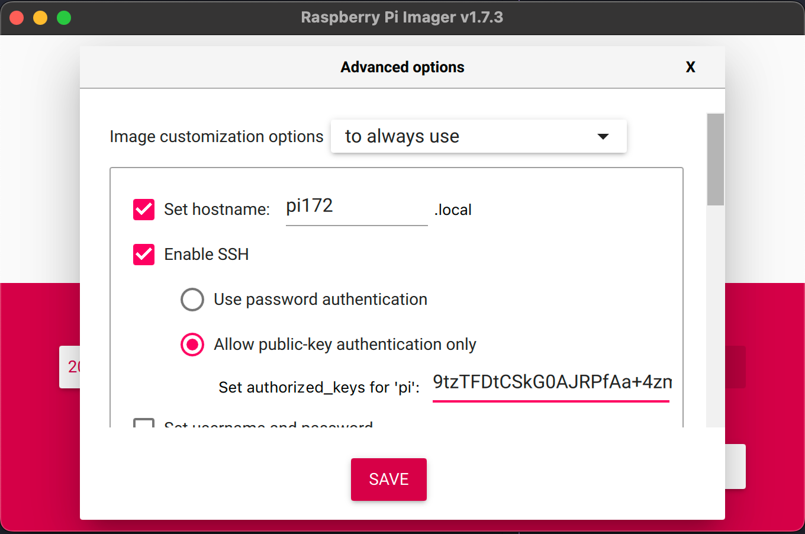
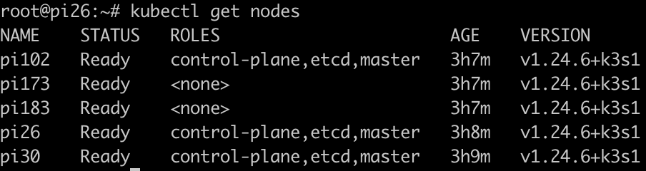
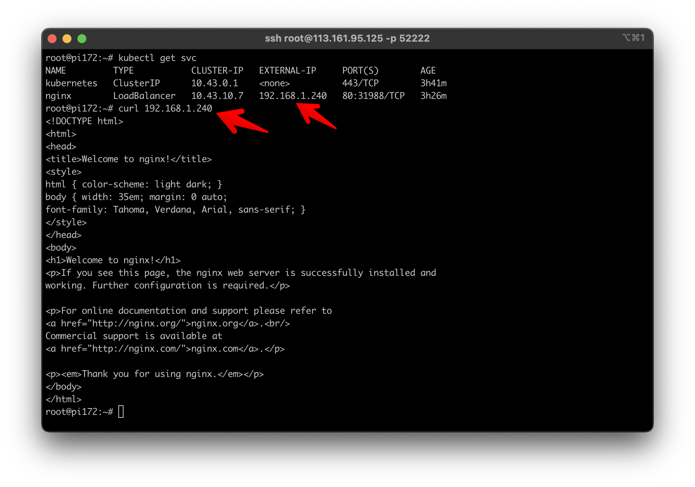

# Setup OS
(10/2022) Raspbian 64 bit is not working well at this time.    
Install Raspbian 32 bit and change config file to 64 bit alternative. Install Raspbian with hostname (unique among nodes)


Use root user so every command don't need `sudo`  
Update package
```bash
apt update && apt upgrade -y
```
Append to file `/boot/cmdline.txt`

```bash
cgroup_enable=cpuset cgroup_enable=memory cgroup_memory=1
```

Append to file `/boot/config.txt`
```bash
arm_64bit=1
```

Setup iptables for kubernetes
```bash
iptables -F
update-alternatives --set ip6tables /usr/sbin/ip6tables-legacy
```
Setup ssh-key (should use 1 key for all nodes) (import pubkey to  authorized_keys)
```bash
ssh-keygen -t rsa -b 2048
```

Setup static IP (optional). Append file `/etc/dhcpcd.conf`    
$IP is rpi ip
```bash
interface wlan0
static ip_address=$IP/24
static routers=192.168.1.1
static domain_name_servers=192.168.1.1
```
Reboot 
```bash
reboot
```
# Install K3S Cluster HA Embed datastore
The number of master nodes should be odd. If  half or more of the master nodes die, cluster cannot work normally. [This problem discuss here](https://stackoverflow.com/questions/61381604/odd-number-of-master-nodes)

Before config I specified 3 master nodes (pi26, pi30, pi102), 2 worker nodes (pi173, pi183) and 1 pi (pi172) as external computer proxy traffic to cluster using nginx and use k3sup to setup cluster

## All command run on pi172 (external computer)
Install nginx 
```bash
apt install nginx -y
```
Config nginx proxy to k3s cluster. Edit file `/etc/nginx/nginx.conf`
```bash
load_module '/usr/lib/nginx/modules/ngx_stream_module.so';
worker_processes 4;
worker_rlimit_nofile 40000;
events {
	worker_connections 8192;
}
stream {
	upstream k3snodes {
		least_conn;
		server 192.168.1.26:6443 max_fails=3 fail_timeout=5s;
		server 192.168.1.30:6443 max_fails=3 fail_timeout=5s;
        server 192.168.1.102:6443 max_fails=3 fail_timeout=5s;
	}
	server {
		listen 6443;
		proxy_pass k3snodes;
	}
}
```
Install k3sup
```bash
curl -sLS https://get.k3sup.dev | sh -
```

Install `kubectl` command
```bash
curl -LO "https://dl.k8s.io/release/$(curl -L -s https://dl.k8s.io/release/stable.txt)/bin/linux/arm64/kubectl"
```
```bash
install -o root -g root -m 0755 kubectl /usr/local/bin/kubectl
```

Install k3s to first node
```bash
k3sup install --host=pi30 --user=root --cluster --tls-san 192.168.1.172 --k3s-extra-args="--no-deploy servicelb --no-deploy traefik --node-taint node-role.kubernetes.io/master=true:NoSchedule"
```
Add master node
```bash
k3sup join --host=pi26 --server-user=root --server-host=192.168.1.30 --user=root --server --k3s-extra-args="--no-deploy servicelb --no-deploy traefik --node-taint node-role.kubernetes.io/master=true:NoSchedule"
```
```bash
k3sup join --host=pi102 --server-user=root --server-host=192.168.1.30 --user=root --server --k3s-extra-args="--no-deploy servicelb --no-deploy traefik  --node-taint node-role.kubernetes.io/master=true:NoSchedule"
```
Add worker node
```bash
k3sup join --host=pi183 --server-user=root --server-host=192.168.1.30 --user=root
```
```bash
k3sup join --host=pi173 --server-user=root --server-host=192.168.1.30 --user=root
````
Config `kubectl` command tls
```bash
mkdir ~/.kube
```
Scp file from master node
```bash
scp -o "StrictHostKeyChecking no" root@pi30:/etc/rancher/k3s/k3s.yaml ~/.kube/
```
```bash
mv ~/.kube/k3s.yaml ~/.kube/config
```

Run command check cluster
```bash
kubectl get nodes
```

# MetalLB
> Kubernetes does not offer an implementation of network load balancers (Services of type LoadBalancer) for bare-metal clusters. The implementations of network load balancers that Kubernetes does ship with are all glue code that calls out to various IaaS platforms (GCP, AWS, Azure…). If you’re not running on a supported IaaS platform (GCP, AWS, Azure…), LoadBalancers will remain in the “pending” state indefinitely when created. [source](https://metallb.universe.tf/)

Run metallb in cluster
```bash
kubectl apply -f https://raw.githubusercontent.com/metallb/metallb/v0.13.5/config/manifests/metallb-native.yaml
```
**Following step must be run after metallb status is RUNNING**  

Setup ip address pool for load balancer. Choose range ip unused, this ip will be assigned to the LB service
```bash
#pools.yaml
kind: IPAddressPool
metadata:
  name: first-pool
  namespace: metallb-system
spec:
  addresses:
  - 192.168.1.240-192.168.1.250
```
Run yaml file
```bash
kubectl apply -f pools.yaml
```

Default load balancer is not routing to router. External machine in LAN cannot access.
Setup service advertisement load balancer IP
```bash
# advert.yaml
apiVersion: metallb.io/v1beta1
kind: L2Advertisement
metadata:
  name: example
  namespace: metallb-system
```
Run yaml file
```bash
kubectl apply -f advert.yaml
```

Run service to test LB
```bash
#test.yaml
apiVersion: apps/v1
kind: Deployment
metadata:
  name: nginx
spec:
  replicas: 2
  selector:
    matchLabels:
      app: nginx
  template:
    metadata:
      labels:
        app: nginx
    spec:
      containers:
      - name: nginx
        image: nginx
        ports:
        - containerPort: 80
```
```bash
kubectl expose deploy nginx --port 80 --type LoadBalancer
```
If can curl external-ip of LoadBalancer service from any host in LAN, this was worked


Reference links:
* [Metallb install](https://www.youtube.com/watch?v=2SmYjj-GFnE&list=PL34sAs7_26wNBRWM6BDhnonoA5FMERax0&index=62)
* [Metallb install (custom command above link) ](https://metallb.universe.tf/installation/)